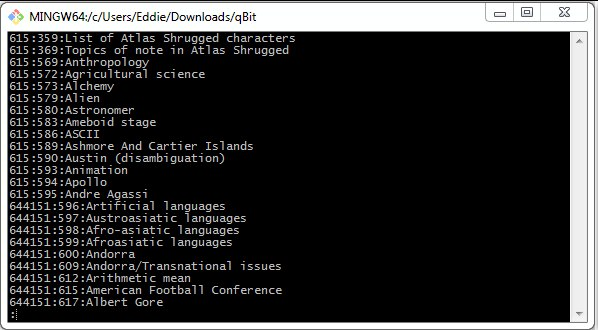
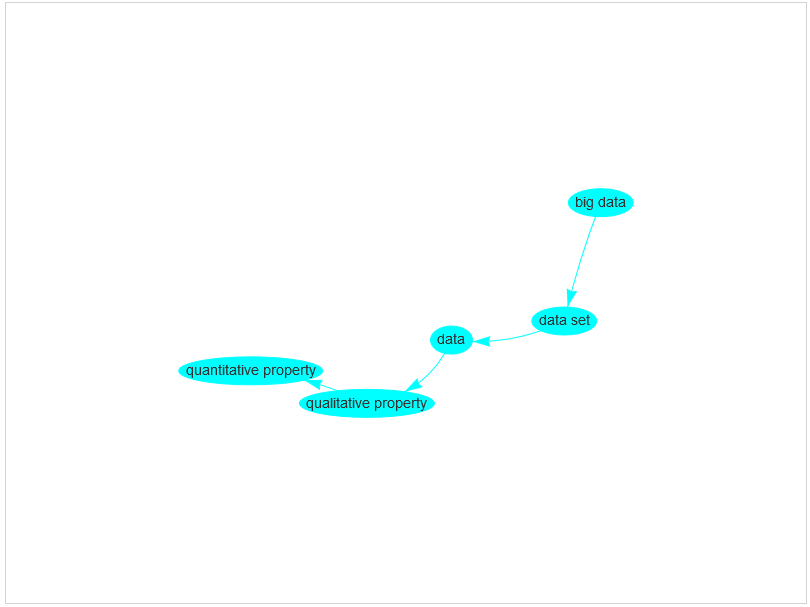
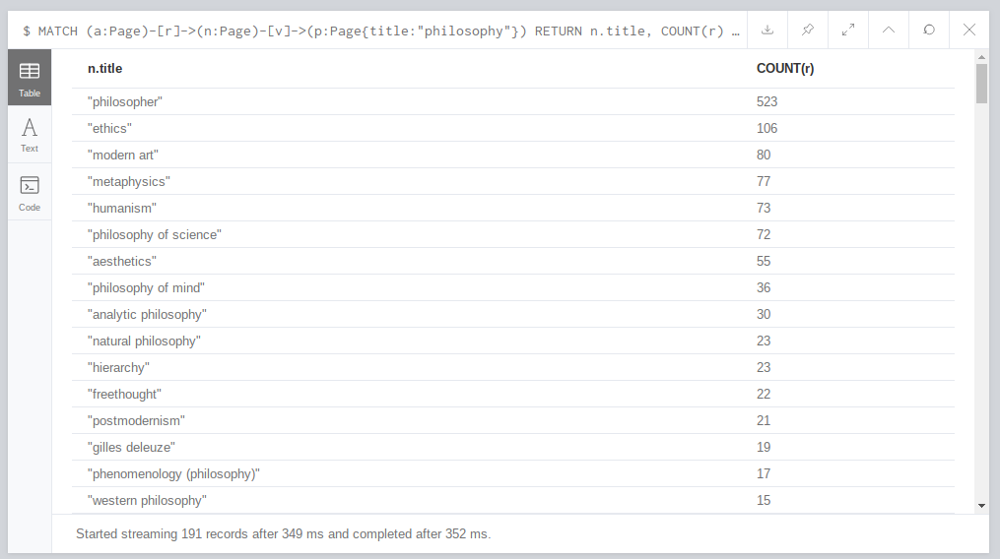
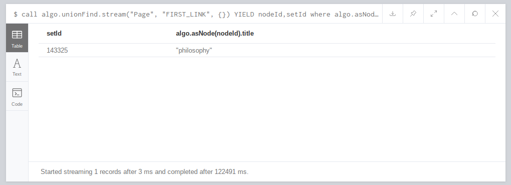
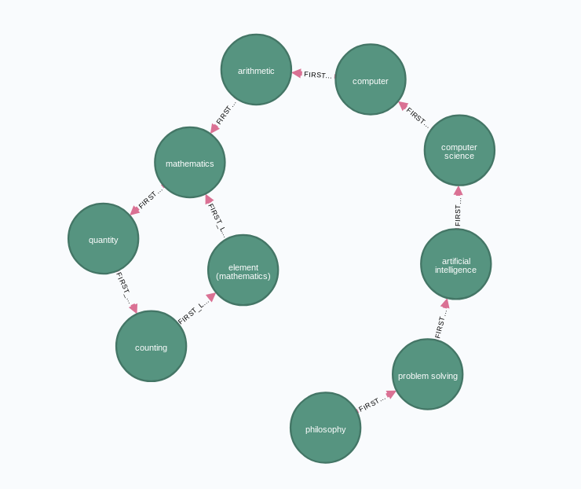

# Wikilosophy

## Project context and objectives

### Initial observation

> *Wikipedia trivia: if you take any article, click on the first link in the article text not in parentheses or italics, and then repeat, you will eventually end up at **Philosophy***

### Context

* Previous quote first appeared on the alt-text of the [xkcd webcomic #903](https://xkcd.com/903/)
* As of February 2016, 97% of all articles lead to Philosophy in this manner

### Why does this happen?

- Most pages start by describing the topic of the page
- Topics naturally get broader as they contain multiple other topics
- Eventually we reach the widest reaching pages, such as Mathematics, Science, and Philosophy

###  Objectives

- Crawl the entirety of the English Wikipedia in this manner (code should be easily adaptable to other languages)
- Calculate an up-to-date estimate of how many pages lead to Philosophy
- Calculate connected components sizes
- Estimate average distance from a random page to Philosophy
- Graph visualization if feasible

### Expected result

- A large connected component that includes most of the pages that do not lead to Philosophy

- We expect another large science-related page

- A large number of authorities linking to the Philosophy page (the graph should have a tree structure leading to Philosophy)

- A certain number of dead-ends, pages with no valid hyperlink leading to a new page

### Risks and problems

- Large graph size might make visualisations unfeasible
- Since the 2016 estimate, there are a lot more pages that do not lead to Philosophy (Based on random tests we performed)
- Group has no experience with Neo4j or Apache Commons Compress API

## Data source and treatments
### Data

- Wikipedia regularly blocks IP addresses performing excessive crawling (not viable for an entire site crawl)
- A downloadable database of all Wikipedia pages is available as XML
- Contains an index with byte offsets allowing to decompress 100 page sections at a time
- Approximately 16GB in size and 200MB for the index

### Index structure

- Byte offset
- Page ID
- Page Title



### Graph generation

- Each page represents a graph vertex

- Easy to create an edge list using the index

- - Unzip 100 pages
  - For each page, find the first hyperlink not in italic or parentheses
  - Place the start and end vertices separated by a tab character in a file

- Size of edge list should around the same size as the index since they both contain one line per page

- Must only be done once (unless using a different dump or language)


## Planification and work 
- Decompress XML pages using a Java library (By 10.05)
- Parse the XML to find the first valid hyperlink (By 10.05)
- Create graph and import to Neo4j (By 17.05)
- Analyse graph using Neo4j and aggregate interesting statistics (By 24.05)
- Finish project, complete report, add any additional features like visualisations (By 07.06)
- Finishing touches for project end date (10.06)

## Functionalities and results

### Neo4j (using `Cypher`queries)

#### Load data from CSV file

In our case, we loaded two local CSV files to neo4j: 

* `node.csv`: contains all pages titles (nodes in neo4j)

  ```cypher
  CREATE CONSTRAINT ON (n:Page) ASSERT n.title IS UNIQUE
  ```

  Here we create the constraint for indexation. This will accelerate the load. We use `MERGE` instead of `create` because to avoid constraint violation (unique title, or the file `node.csv` can contain duplicates)

  ```cypher
  USING PERIODIC COMMIT 500
  LOAD CSV FROM "file:///nodes.csv" as row
  MERGE (p:Page {title: row[0]})
  ```

* `output_clean.csv`: contains all relationships between pages in form `page|first_link`

  ```cypher
  USING PERIODIC COMMIT 500
  LOAD CSV WITH HEADERS FROM "file:///output_clean.csv" as row FIELDTERMINATOR '|'
  MATCH (a :Page { title: row.src })
  MATCH (b :Page { title: row.dest })
  MERGE (a)-[:FIRST_LINK]->(b)
  ```

  

### Vis.js application (proof-of-concept)
The vis.js application does not rely on a graph to find paths, rather it stores all edges in a Map (src -> dest) and uses it to find a path. After prompting the user for a starting node, it queries the Map for a next node. If it exists, it adds both nodes and a link between them to a vis.js network and repeats using the next node as input. When the map does not return a next node, the loop stops and the graph is displayed.



In this case, "web mining" eventually leads to "quantitative property", which contains a redirect link and therefore does not appear in the Map, ending the path. Redirects are not properly handled by our parser, leading to prematurely ending some paths.
### Neovis application

This is a graph visualization tool powered by vis.js with data from Neo4j. We can use this tool in a simple html page using javascript. First we include the `neovis.js` file:

```html
<script src="https://rawgit.com/neo4j-contrib/neovis.js/master/dist/neovis.js"></script>
```

And then we can instantiate 

### Neo4j analysis

* Authorities leading to **philosophy** page

```cypher
MATCH (a:Page)-[r]->(n:Page)-[v]->(p:Page{title:"philosophy"}) RETURN n.title, COUNT(r)
ORDER by count(r) DESC;
```



* Size of top 100 connected components

  ```cypher
  call algo.unionFind.stream("Page", "FIRST_LINK", {})
  YIELD nodeId,setId
  return setId,count(*) as size_of_component
  order by size_of_component desc
  LIMIT 100;
  ```

  

* To prove that **philosophy** is in the biggest connected component

  ```cypher
  call algo.unionFind.stream("Page", "FIRST_LINK", {})
  YIELD nodeId,setId
  where algo.asNode(nodeId).title = "philosophy"
  return setId, algo.asNode(nodeId).title
  ```

  

* Visualize path between a random page and **philosophy**

  ```cypher
  Match p=(p1:Page{title:"philosophy"})-[FIRST_LINK*1..20]->(p3:Page{title:"element (mathematics)"}) return p
  ```

  

* Count the number of pages leading to **philosophy** after `10` link

  ```cypher
  MATCH (a:Page)-[FIRST_LINK*10]->(p:Page{title:"philosophy"}) RETURN count(a)
  ```

  

## Techniques, algorithms and tools

### Tools
- Java

- Apache Commons Compress API for decompression (Allows the use of an offset)

- Neo4j (Allows graph analysis and importation using an edge list)
### Algorithms
#### Connected components


## Conclusion
