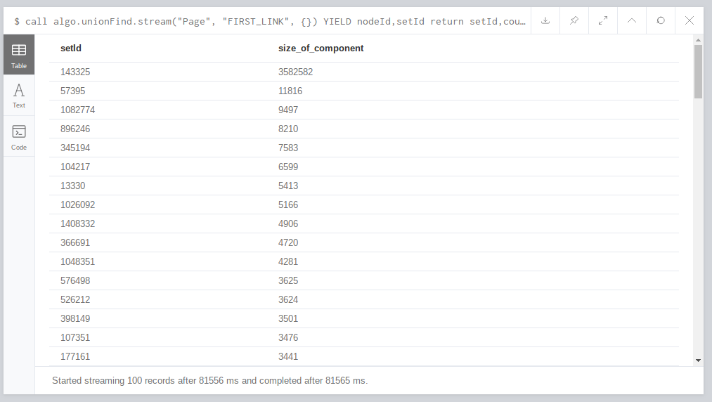
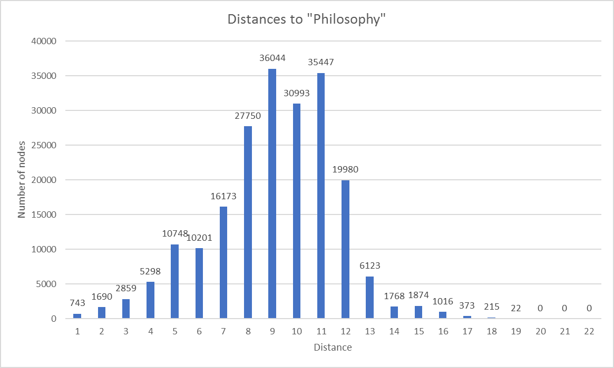

# Wikilosophy

## Project context and objectives

### Initial observation

> *Wikipedia trivia: if you take any article, click on the first link in the article text not in parentheses or italics, and then repeat, you will eventually end up at **Philosophy***

### Context

* Previous quote first appeared on the alt-text of the [xkcd webcomic #903](https://xkcd.com/903/)
* As of February 2016, 97% of all articles lead to Philosophy in this manner

### Why does this happen?

- Most pages start by describing the topic of the page
- Topics naturally get broader as they contain multiple other topics
- Eventually we reach the widest reaching pages, such as Mathematics, Science, and Philosophy

###  Objectives

- Crawl the entirety of the English Wikipedia in this manner (code should be easily adaptable to other languages)
- Calculate an up-to-date estimate of how many pages lead to Philosophy
- Calculate connected components sizes
- Estimate average distance from a random page to Philosophy
- Graph visualization if feasible

### Expected result

- A large connected component that includes most of the pages that do not lead to Philosophy

- We expect another large science-related page

- A large number of authorities linking to the Philosophy page (the graph should have a tree structure leading to Philosophy)

- A certain number of dead-ends, pages with no valid hyperlink leading to a new page

### Risks and problems

- Large graph size might make visualisations unfeasible
- Since the 2016 estimate, there are a lot more pages that do not lead to Philosophy (Based on random tests we performed)
- Group has no experience with Neo4j or Apache Commons Compress API

## Data source and treatments
### Data

- Wikipedia regularly blocks IP addresses performing excessive crawling (not viable for an entire site crawl)
- A downloadable database of all Wikipedia pages is available as XML
- Contains an index with byte offsets allowing to decompress 100 page sections at a time
- Approximately 16GB in size and 200MB for the index

### Index structure

- Byte offset
- Page ID
- Page Title


### Graph generation

Each page represents a graph vertex. Easy to create an edge list using the index

- Unzip 100 pages
- For each page, find the first hyperlink not in italic or parentheses
- Place the start and end vertices separated by a tab character in a file

This work is done after executing [`src/extract_wikilinks.py`](https://github.com/RaedAbr/Wikilosophy/blob/master/src/extract_wikilinks.py) python script. The size of edge list should be around the same size as the index since they both contain one line per page. This must only be done once (unless using a different dump or language)

Then, based on the output of the parsing, we clean our file using the [`src/clean_data.py`](https://github.com/RaedAbr/Wikilosophy/blob/master/src/clean_data.py) python script (remove internal links, files links, wikimedia links..)

Finally, we create a file containing all pages titles (all nodes) via script [`src/build_nodes.py`](https://github.com/RaedAbr/Wikilosophy/blob/master/src/build_nodes.py)


## Planification and work 
- Decompress XML pages using a Java library (By 10.05)
- Parse the XML to find the first valid hyperlink (By 10.05)
- Create graph and import to Neo4j (By 17.05)
- Analyse graph using Neo4j and aggregate interesting statistics (By 24.05)
- Finish project, complete report, add any additional features like visualisations (By 07.06)
- Finishing touches for project end date (10.06)

## Functionalities and results

### Neo4j

#### Running Neo4j in docker container

- Get and run neo4j server using docker: [neo4j Docker Official Images](https://hub.docker.com/_/neo4j)

  - Pull neo4j docker image:

    ```bash
    docker pull neo4j
    ```

  - Start an instance of neo4j

    ```bash
    docker run \
        --publish=7474:7474 --publish=7687:7687 \
        --volume=$HOME/neo4j/data:/data \
        neo4j
    ```

    which allows you to access neo4j through your browser at [http://localhost:7474](http://localhost:7474/).

    This binds two ports (`7474` and `7687`) for HTTP and Bolt access to the Neo4j API. A volume is bound to `/data` to allow the database to be persisted outside the container.

    By default, this requires you to login with `neo4j/neo4j` and change the password. You can, for development purposes, disable authentication by passing `--env=NEO4J_AUTH=none` to docker run.

- Copy local csv file to the container:

  ```bash
   docker cp csvfile.csv neo4j_container_name:/var/lib/neo4j/import
  ```

------

#### Running  Neo4j aws in EC2 instance

[Hosting Neo4j on EC2 on AWS](https://neo4j.com/developer/neo4j-cloud-aws-ec2-ami/)

aws Image (AMI): 

- AMI id: `ami-09fd9357f1d8194ad`

- AMI name: `neo4j-community-1-3.5.5-apoc 2019-05-09T03_08_06Z`

  After launching the instance, use user name `neo4j` and password `the instance id`

Now, Neo4j is running and can be accessed via the navigator

```
https://[ip_address_or_dns]:7474
```

------

#### Load data from CSV file

In our case, we loaded two local CSV files to neo4j: 

* `node.csv`: contains all pages titles (nodes in neo4j)

  ```cypher
  CREATE CONSTRAINT ON (n:Page) ASSERT n.title IS UNIQUE
  ```

  Here we create the constraint for indexation. This will accelerate the load. We use `MERGE` instead of `create` because to avoid constraint violation (unique title, or the file `node.csv` can contain duplicates)

  ```cypher
  USING PERIODIC COMMIT 500
  LOAD CSV FROM "file:///nodes.csv" as row
  MERGE (p:Page {title: row[0]})
  ```

* `output_clean.csv`: contains all relationships between pages in form `page|first_link`

  ```cypher
  USING PERIODIC COMMIT 500
  LOAD CSV WITH HEADERS FROM "file:///output_clean.csv" as row FIELDTERMINATOR '|'
  MATCH (a :Page { title: row.src })
  MATCH (b :Page { title: row.dest })
  MERGE (a)-[:FIRST_LINK]->(b)
  ```

------


### Vis.js application (proof-of-concept)
The [vis.js](https://visjs.org/) application does not rely on a graph to find paths, rather it stores all edges in a Map (src -> dest) and uses it to find a path. After prompting the user for a starting node, it queries the Map for a next node. If it exists, it adds both nodes and a link between them to a vis.js network and repeats using the next node as input. When the map does not return a next node, the loop stops and the graph is displayed.


In this case, "web mining" eventually leads to "quantitative property", which contains a redirect link and therefore does not appear in the Map, ending the path. Redirects are not properly handled by our parser, leading to prematurely ending some paths. A longer path, including philosophy, can be seen here:


To use this application, place the file `output.csv` generated by the python parser / cleaner in the `pathviewer` directory. Make sure the file start with `src\tdest` and uses tabs to seperate values. Then, simply open `index.html` in any browser. Note that this file is too large to include on this repository (230MB).
------

### Neovis application

[Project repository link](https://github.com/neo4j-contrib/neovis.js)

This is a graph visualization tool powered by vis.js with data from Neo4j. We can use this tool in a simple html page using javascript. First we include the `neovis.js` file:

```html
<script src="https://rawgit.com/neo4j-contrib/neovis.js/master/dist/neovis.js"></script>
```

And then we can instantiate new `neovis` instance:

```javascript
new NeoVis.default(config);
```

In the `config` variable, we specify :

* The container id of the `html` element where the graph will be inserted
* The Neo4j server url, user name and password
* The graphical properties of the nodes and relationships 
* And finally the initial cypher query to be executed

```js
var config = {
    container_id: "viz",
    server_url: "bolt://ec2-54-86-68-3.compute-1.amazonaws.com:7687",
    server_user: "neo4j",
    server_password: "i-068dfc9ff6dd04a36",
    labels: {
        "Page": {
            caption: "title",
            size: "pagerank",
            community: "community"
        }
    },
    relationships: {
        "FIRST_LINK": {
            caption: false
        }
    },
    initial_cypher: "MATCH p=()-[r:FIRST_LINK]->() RETURN p"
};
```

------
### <a name="commands">Neo4j analysis

* Authorities leading to **philosophy** page

```cypher
MATCH (a:Page)-[r]->(n:Page)-[v]->(p:Page{title:"philosophy"}) RETURN n.title, COUNT(r)
ORDER by count(r) DESC;
```


* Size of top 100 connected components

  ```cypher
  call algo.unionFind.stream("Page", "FIRST_LINK", {})
  YIELD nodeId,setId
  return setId,count(*) as size_of_component
  order by size_of_component desc
  LIMIT 100;
  ```

  

* To prove that **philosophy** is in the biggest connected component

  ```cypher
  call algo.unionFind.stream("Page", "FIRST_LINK", {})
  YIELD nodeId,setId
  where algo.asNode(nodeId).title = "philosophy"
  return setId, algo.asNode(nodeId).title
  ```

  

* Visualize path between a random page and **philosophy**

  ```cypher
  Match p=(p1:Page{title:"philosophy"})-[FIRST_LINK*1..20]->(p3:Page{title:"element (mathematics)"}) return p
  ```

  

*  <a name="histo">Count the number of pages leading to **philosophy** after `10` link

  ```cypher
  MATCH (a:Page)-[FIRST_LINK*10]->(p:Page{title:"philosophy"}) RETURN count(a)
  ```

By counting these pages, for distance 1 to n (we stopped when no more paths appeared), we can create a histogram of how many pages are at distance n of Philosophy:



We can see that the distances resemble a normal distribution centred around 10. The majority of pages lead to Philosophy in 8-12 pages using the initial observation.

## Techniques, algorithms and tools

### Tools
- Python scripts to parse Wikipedia
- [mwparserfromhell](https://github.com/earwig/mwparserfromhell) to help extract Wikicode
- Python Bz2 library to decompress the archive with offsets
- Neo4j (Allows graph analysis and importation using an edge list)
- An Amazon AWS instance to store and perform operations on the graph

### Algorithms
#### Connected components
We used the neo4j [unionFind](https://neo4j.com/docs/graph-algorithms/current/algorithms/connected-components/) algorithm to calculate connected components and their sizes.

#### Unused
While we initially tried to use neo4j's  [centrality algorithms](https://neo4j.com/docs/graph-algorithms/current/algorithms/centrality/) (notably PageRank and Harmonic Centrality on the inverted graph to calculate distances) we were unably to do so due to memory and time constraints. The PageRank algorithm quickly crashed due to lack of memory and the Harmonic Centrality did not terminate after several hours. We instead manually checked how many nodes were at distance n (see [here](#histo)).

#### Other
All neo4j commands used can be found [here](#commands).
## Conclusion
During our analysis, we discovered that Philosophy is not contained in a loop like on the current Wikipedia site (10.06.2019). Indeed, it leads to the page "Mathematics", which is included in a loop. Therefore, all pages in the connected component do not necessarily lead to Philosophy, but to Mathematics. This means that the inital observation, which was made and tested back in February 2016, was not accurate as of the time our data dump was taken (01.01.2019). 


Due to some issues with our parser (especially redirect pages) we have more dead ends than expected and often fail to continue a path despite there being one after the redirect. We also notice a large discrepancy between the number of pages in the connected component and the number of pages which lead to "Philosophy" with distances 1...n. This is because since Philosophy is no longer part of a loop, we are not guaranteed that all pages in the connected component will end up there. As of the 1st of January 2019, the true king of Wikipedia was no longer Philosophy, but Mathematics. As a future improvement, it would be interesting to either repeat the project on the same dump using Mathematics as the main point of interest (Wikimatics?), or use a different dump where Philosophy was contained in a loop.

