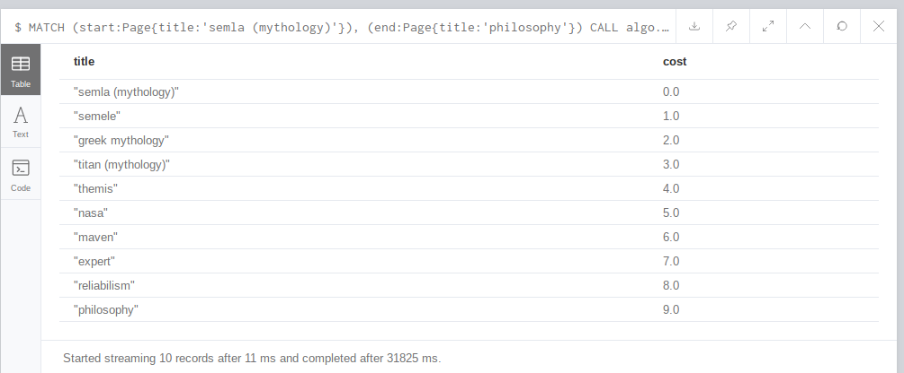

## With docker container

* Get and run neo4j server using docker: [link](https://hub.docker.com/_/neo4j)

  * Pull neo4j docker image:

    ```bash
    docker pull neo4j
    ```

  * Start an instance of neo4j

    ```bash
    docker run \
        --publish=7474:7474 --publish=7687:7687 \
        --volume=$HOME/neo4j/data:/data \
        neo4j
    ```

    which allows you to access neo4j through your browser at [http://localhost:7474](http://localhost:7474/).

    This binds two ports (`7474` and `7687`) for HTTP and Bolt access to the Neo4j API. A volume is bound to `/data` to allow the database to be persisted outside the container.

    By default, this requires you to login with `neo4j/neo4j` and change the password. You can, for development purposes, disable authentication by passing `--env=NEO4J_AUTH=none` to docker run.

* Copy local csv file to the container:

  ```bash
   docker cp csvfile.csv neo4j_container_name:/var/lib/neo4j/import
  ```

## With aws EC2 instance

[Link](https://neo4j.com/developer/neo4j-cloud-aws-ec2-ami/)

Image : 

* AMI id: `ami-09fd9357f1d8194ad`
* AMI name: `neo4j-community-1-3.5.5-apoc 2019-05-09T03_08_06Z`

After launching the instance, use user name `neo4j` and password `the instance id`

* In neo4j browser, run:

  ### Load data
  
  * Load local CSV file and create nodes

    `nodes.csv` file to create nodes
  
    ```
    CREATE CONSTRAINT ON (n:Page) ASSERT n.title IS UNIQUE
    ```
  
    Here we use `MERGE` instead of `create` because to avoid constraint violation (unique title, or the file `node.csv` can contain duplicates)
  
    ```
    USING PERIODIC COMMIT 500
    LOAD CSV FROM "file:///nodes.csv" as row
    MERGE (p:Page {title: row[0]})
    ```
  
    `output_clean.csv` file to create relationships
  
    ```
    USING PERIODIC COMMIT 500
    LOAD CSV WITH HEADERS FROM "file:///output_clean.csv" as row FIELDTERMINATOR '|'
    MATCH (a :Page { title: row.src })
    MATCH (b :Page { title: row.dest })
    MERGE (a)-[:FIRST_LINK]->(b)
    ```
  
    
  
  ### Apply PageRank Algorithm and community detection using the The Label Propagation algorithm
  
  * To make algorithms work, this line must be added to the neo4j config template (`/etc/neo4j/neo4j.template`) and then restart neo4j service ([link1](https://stackoverflow.com/questions/48773505/neo4j-install-apoc-and-graph-algorithms-neo-clienterror-procedure-procedureregis))
  
    ```
    dbms.security.procedures.unrestricted=algo.*,apoc.*
    ```
  
  * [The PageRank algorithm](https://neo4j.com/docs/graph-algorithms/current/algorithms/page-rank/)
  
    >PageRank is an algorithm that measures the **transitive** influence or connectivity of nodes.
    >
    >It can be computed by either iteratively distributing one node’s rank (originally based on degree) over its neighbours or by randomly traversing the graph and counting the frequency of hitting each node during these walks.
    >
    >PageRank is a variant of [Eigenvector Centrality](https://neo4j.com/docs/graph-algorithms/current/algorithms/eigenvector-centrality/).
  
    ```
    CALL algo.pageRank.stream('Page', 'FIRST_LINK', {iterations:20, dampingFactor:0.85})
    YIELD nodeId, score
    
    RETURN algo.asNode(nodeId).title AS page,score
    ORDER BY score DESC
    ```
  
    ```
    CALL algo.pageRank('Page', 'FIRST_LINK',
      {iterations:20, dampingFactor:0.85, write: true,writeProperty:"pagerank"})
    YIELD nodes, iterations, loadMillis, computeMillis, writeMillis, dampingFactor, write, writeProperty
    ```
  
    This will add `pagerank` property to each node
  
  * [The Label Propagation algorithm](https://neo4j.com/docs/graph-algorithms/current/algorithms/label-propagation/)
  
    > The Label Propagation algorithm (LPA) is a fast algorithm for finding communities in a graph. It detects these communities using network structure alone as its guide, and doesn’t require a pre-defined objective function or prior information about the communities.
    >
    > One interesting feature of LPA is that nodes can be assigned preliminary labels to narrow down the range of solutions generated. This means that it can be used as semi-supervised way of finding communities where we hand-pick some initial communities.
  
    ```
    CALL algo.labelPropagation.stream("Page", "FIRST_LINK",
      {direction: "OUTGOING", iterations: 10})
    ```
  
    ```
    CALL algo.labelPropagation('Page', 'FIRST_LINK',
      {iterations:10, writeProperty:'community', write:true, direction: 'OUTGOING'})
    YIELD nodes, iterations, loadMillis, computeMillis, writeMillis, write, writeProperty;
    ```
  
    This will add `community` property to each node
  
  ### Display the graph using `neovis.js` (simple html file)
  
  ```html
  <!doctype html>
  <html>
  <head>
      <title>Neovis.js Simple Example</title>
      <style type="text/css">
          html, body {
              font: 16pt arial;
          }
          #viz {
              width: 100%;
              height: 600px;
              border: 1px solid lightgray;
              font: 22pt arial;
          }
      </style>
  
      <!-- FIXME: load from dist -->
      <script src="https://rawgit.com/neo4j-contrib/neovis.js/master/dist/neovis.js"></script>
  
  
      <script
              src="https://code.jquery.com/jquery-3.2.1.min.js"
              integrity="sha256-hwg4gsxgFZhOsEEamdOYGBf13FyQuiTwlAQgxVSNgt4="
              crossorigin="anonymous"></script>
  
      <script type="text/javascript">
  		// define config car
  		// instantiate nodevis object
  		// draw
  		var viz;
  		function draw() {
  			var config = {
  				container_id: "viz",
  				server_url: "bolt://ec2-54-86-68-3.compute-1.amazonaws.com:7687",
  				server_user: "neo4j",
  				server_password: "i-068dfc9ff6dd04a36",
  				labels: {
  					"Page": {
  						caption: "title",
  						size: "pagerank",
                          community: "community"
  					}
  				},
  				relationships: {
  					"FIRST_LINK": {
  						caption: false
  					}
  				},
  				initial_cypher: "MATCH p=()-[r:FIRST_LINK]->() RETURN p"
  			};
  			viz = new NeoVis.default(config);
  			viz.render();
  			console.log(viz);
  		}
      </script>
  </head>
  <body onload="draw()">
  <div id="viz"></div>
  
  
  Cypher query: <textarea rows="4" cols=50 id="cypher"></textarea><br>
  <input type="submit" value="Submit" id="reload">
  <input type="submit" value="Stabilize" id="stabilize">
  
  
  </body>
  
  <script>
  	$("#reload").click(function() {
  		var cypher = $("#cypher").val();
  		if (cypher.length > 3) {
  			viz.renderWithCypher(cypher);
  		} else {
  			console.log("reload");
  			viz.reload();
  		}
  	});
  	$("#stabilize").click(function() {
  		viz.stabilize();
  	})
  </script>
  </html>
  ```
  
  

### Get path between a page and *philosophy*

[Shortest path planning](https://neo4j.com/docs/cypher-manual/current/execution-plans/shortestpath-planning/)

```
MATCH (start:Page{title:'semla (mythology)'}), (end:Page{title:'philosophy'})
CALL algo.shortestPath.stream(start, end, 'cost')
YIELD nodeId, cost
RETURN algo.asNode(nodeId).title AS title, cost
```

Results:



### Get the top 20 biggest component 

```
CALL algo.unionFind.stream('Page', 'FIRST_LINK', {})
YIELD nodeId,setId
RETURN setId,count(*) as size_of_component
ORDER BY size_of_component desc
LIMIT 20;
```

### Visualize path between a random page and *philosophy*

```
Match p=(p1:Page{title:"tanase"})-[FIRST_LINK*1..100]->(p3:Page{title:"philosophy"}) return p
```

